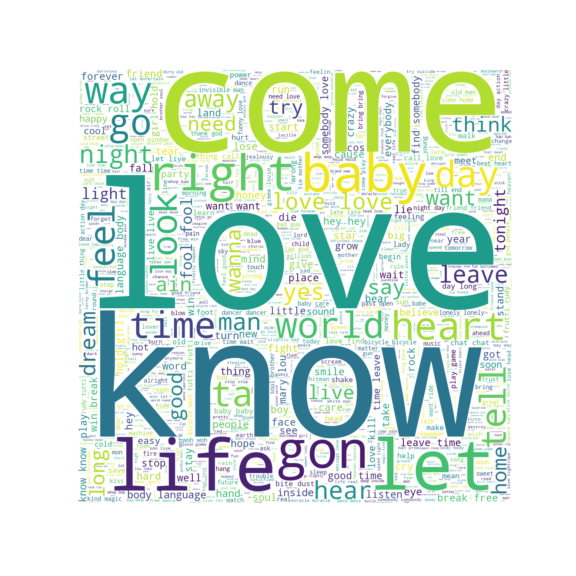
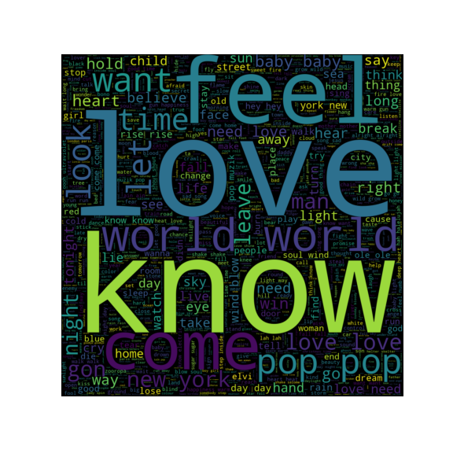

# Web scraping and NLP text classification project

In this project, we will build a text classification model on song lyrics. The task is to predict the artist from a piece of text. To train such a model, you first need to collect your own lyrics dataset:
- Download a HTML page with links to songs
- Extract hyperlinks of song pages
- Download and extract the song lyrics
- Vectorize the text using the Bag Of Words method
- train a classification model that predicts the artist from a piece of text

I scraped lyrics of 2 bands Queen and U2 with BeautifulSoup package
created Bag of words and TFIDF matrices. 
Trained models LOGISTIC REGRESSION, Naive byers and Random Forest to predict the name of band.
Naive Byers showed best scores.
I created WordCloud plots and Topic Modeling foe each band. 
Our lyrics pretty similar, so maximum accuracy I could reach is about 73%

### Queen 

### U2 

